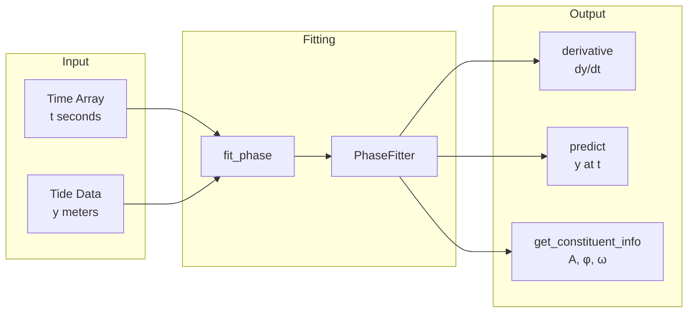
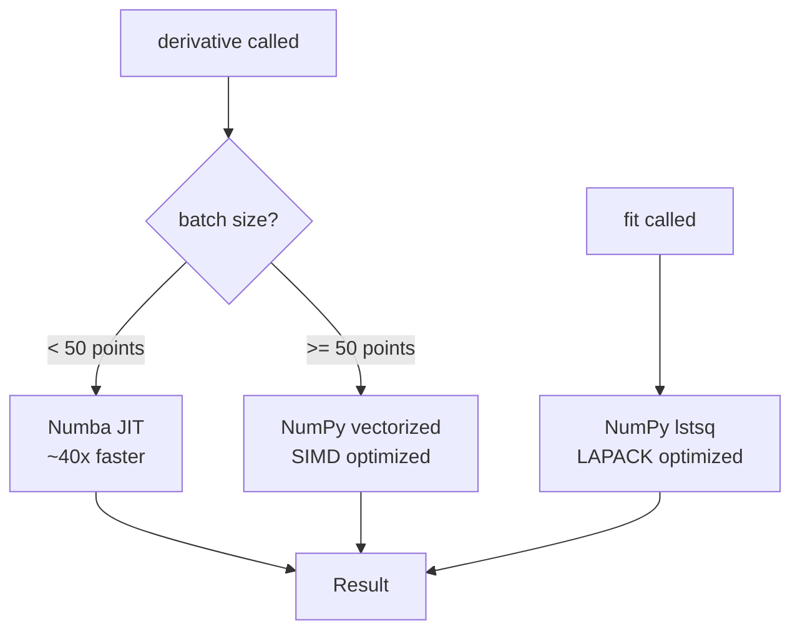
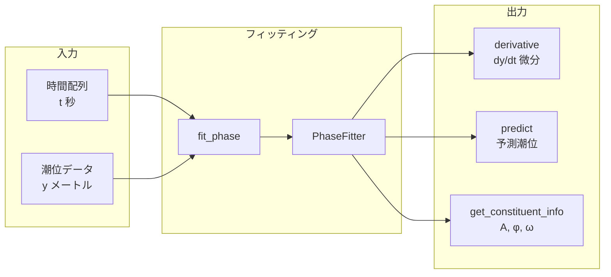
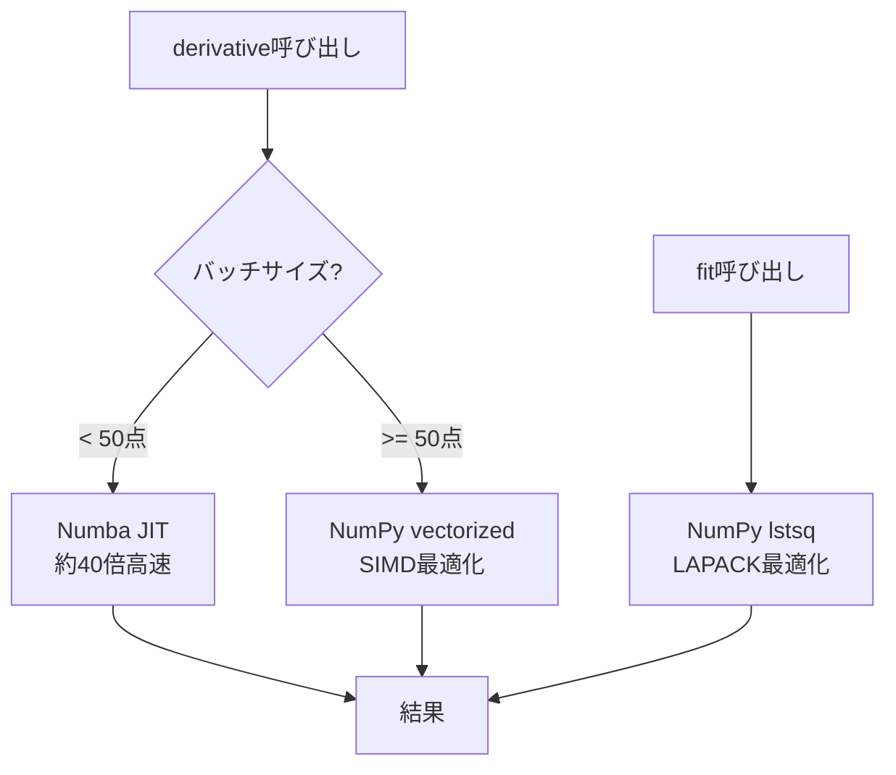

# Aux API - Phase Calculation Module

[English](#english) | [日本語](#japanese)

---

<a name="english"></a>
## English

### Overview

The `pyTMD_turbo.phase` module provides phase fitting and derivative computation for tidal predictions.

#### Features

- **Phase Fitting**: Simultaneous fitting of multiple tidal constituents (M2, S2, K1, O1, N2, etc.)
- **Derivative Computation**: dy/dt = Σ A_i × ω_i × cos(ω_i × t + φ_i)
- **Prediction**: Predict tide heights at arbitrary times from fitted results

#### Workflow



#### Mathematical Background

Tides are modeled as a superposition of periodic components:

```
y(t) = Σ A_i × sin(ω_i × t + φ_i) + C
```

Where:
- `A_i`: Amplitude (m)
- `ω_i`: Angular frequency (rad/s)
- `φ_i`: Phase (rad)
- `C`: Offset

The derivative is:

```
dy/dt = Σ A_i × ω_i × cos(ω_i × t + φ_i)
```

### Installation

```python
from pyTMD_turbo.phase import PhaseFitter, fit_phase, get_omega
```

### Quick Start

```python
import numpy as np
from pyTMD_turbo.phase import fit_phase

# Tide data (t: seconds, y: meters)
t = np.linspace(0, 3 * 86400, 240)  # 3 days, 240 points
y = tide_heights  # Tide height data

# Fitting
fitter = fit_phase(t, y)

# Derivative at arbitrary times
t_eval = np.array([1000.0, 5000.0, 10000.0])
derivatives = fitter.derivative(t_eval)  # m/s

# Convert to m/h
derivatives_per_hour = derivatives * 3600
```

### API Reference

#### PhaseFitter

Main class for phase fitting.

```python
class PhaseFitter:
    def __init__(self, constituents: List[str] = None)
    def fit(self, t: np.ndarray, y: np.ndarray) -> PhaseFitter
    def derivative(self, t: np.ndarray) -> np.ndarray
    def predict(self, t: np.ndarray) -> np.ndarray
    def get_constituent_info(self) -> Dict[str, dict]
```

##### `__init__(constituents=None)`

Initialize the fitter.

**Parameters:**
- `constituents`: List of constituent names. Default: `['m2', 's2', 'k1', 'o1', 'n2']`

**Example:**
```python
# Default (5 constituents)
fitter = PhaseFitter()

# Custom constituents
fitter = PhaseFitter(['m2', 's2', 'n2', 'k1', 'o1', 'p1', 'q1'])
```

##### `fit(t, y)`

Fit phase model to data.

**Parameters:**
- `t`: Time array in seconds
- `y`: Tide height array in meters

**Returns:**
- `self`: For method chaining

##### `derivative(t)`

Compute tide rate of change at specified times.

**Parameters:**
- `t`: Time array or scalar in seconds

**Returns:**
- `np.ndarray`: Derivative values in m/s

**Note:**
- Small batch (< 50 points): Uses Numba JIT (~40x faster)
- Large batch (>= 50 points): Uses NumPy vectorized

##### `predict(t)`

Predict tide heights from fitted results.

**Parameters:**
- `t`: Time array in seconds

**Returns:**
- `np.ndarray`: Predicted tide heights in meters

##### `get_constituent_info()`

Get fitted parameters for each constituent.

**Returns:**
- `dict`: Amplitude, phase, and angular frequency per constituent

**Example:**
```python
info = fitter.get_constituent_info()
for const in ['m2', 's2', 'k1']:
    print(f"{const.upper()}: A={info[const]['amplitude']:.4f} m, "
          f"φ={info[const]['phase_deg']:.1f}°")
```

#### Convenience Functions

##### `fit_phase(t, y, constituents=None)`

Shortcut for fitting.

```python
fitter = fit_phase(t, y)
# equivalent to:
fitter = PhaseFitter().fit(t, y)
```

##### `get_omega(constituent)`

Get angular frequency for a constituent.

```python
omega_m2 = get_omega('m2')  # 0.000140518... rad/s
```

##### `get_omegas(constituents)`

Get angular frequencies as array.

```python
omegas = get_omegas(['m2', 's2', 'k1'])
```

### Supported Constituents

| Constituent | Period (hours) | Description |
|-------------|----------------|-------------|
| **Semi-diurnal** |||
| M2 | 12.42 | Principal lunar |
| S2 | 12.00 | Principal solar |
| N2 | 12.66 | Larger lunar elliptic |
| K2 | 11.97 | Luni-solar |
| **Diurnal** |||
| K1 | 23.93 | Luni-solar |
| O1 | 25.82 | Principal lunar |
| P1 | 24.07 | Principal solar |
| Q1 | 26.87 | Larger lunar elliptic |
| **Long period** |||
| Mf | 327.86 | Lunar fortnightly |
| Mm | 661.31 | Lunar monthly |

### Performance

| Operation | Time | Method |
|-----------|------|--------|
| Small batch derivative (3 points) | 0.88 µs/call | Numba JIT |
| Large batch derivative (1000 points) | 62.3 µs/call | NumPy vectorized |
| Fitting (240 points, 5 constituents) | 65.1 µs/fit | NumPy lstsq |

#### Optimization Strategy



1. **Small batch (< 50 points)**: Numba JIT
   - `@jit(nopython=True, cache=True, fastmath=True)`
   - Single-threaded (no parallel overhead)
   - ~40x faster

2. **Large batch (>= 50 points)**: NumPy vectorized
   - Broadcasting with `np.outer()`
   - SIMD optimized

3. **Fitting**: `np.linalg.lstsq`
   - LAPACK optimized
   - Cannot be improved with Numba

---

<a name="japanese"></a>
## 日本語

### 概要

`pyTMD_turbo.phase` モジュールは、潮汐データから位相をフィッティングし、任意の時刻における微分（変化率）を高速に計算します。

#### 機能

- **位相フィッティング**: 複数の潮汐成分（M2, S2, K1, O1, N2等）を同時にフィッティング
- **微分計算**: dy/dt = Σ A_i × ω_i × cos(ω_i × t + φ_i)
- **予測**: フィッティング結果から任意時刻の潮位を予測

#### ワークフロー



#### 数学的背景

潮汐は複数の周期成分の重ね合わせとしてモデル化されます：

```
y(t) = Σ A_i × sin(ω_i × t + φ_i) + C
```

各パラメータ：
- `A_i`: 振幅（m）
- `ω_i`: 角周波数（rad/s）
- `φ_i`: 位相（rad）
- `C`: オフセット

微分：

```
dy/dt = Σ A_i × ω_i × cos(ω_i × t + φ_i)
```

### インストール

```python
from pyTMD_turbo.phase import PhaseFitter, fit_phase, get_omega
```

### クイックスタート

```python
import numpy as np
from pyTMD_turbo.phase import fit_phase

# 潮汐データ（t: 秒, y: メートル）
t = np.linspace(0, 3 * 86400, 240)  # 3日間、240点
y = tide_heights  # 潮位データ

# フィッティング
fitter = fit_phase(t, y)

# 任意時刻での微分計算
t_eval = np.array([1000.0, 5000.0, 10000.0])
derivatives = fitter.derivative(t_eval)  # m/s

# m/h に変換
derivatives_per_hour = derivatives * 3600
```

### APIリファレンス

#### PhaseFitter

位相フィッティングのメインクラス。

```python
class PhaseFitter:
    def __init__(self, constituents: List[str] = None)
    def fit(self, t: np.ndarray, y: np.ndarray) -> PhaseFitter
    def derivative(self, t: np.ndarray) -> np.ndarray
    def predict(self, t: np.ndarray) -> np.ndarray
    def get_constituent_info(self) -> Dict[str, dict]
```

##### `__init__(constituents=None)`

フィッターを初期化します。

**パラメータ:**
- `constituents`: 成分名のリスト。デフォルト: `['m2', 's2', 'k1', 'o1', 'n2']`

**例:**
```python
# デフォルト（5成分）
fitter = PhaseFitter()

# カスタム成分
fitter = PhaseFitter(['m2', 's2', 'n2', 'k1', 'o1', 'p1', 'q1'])
```

##### `fit(t, y)`

データに位相モデルをフィッティングします。

**パラメータ:**
- `t`: 時間（秒）の配列
- `y`: 潮位（メートル）の配列

**戻り値:**
- `self`: メソッドチェーン用

##### `derivative(t)`

指定時刻での潮位変化率を計算します。

**パラメータ:**
- `t`: 時間（秒）の配列またはスカラー

**戻り値:**
- `np.ndarray`: 微分値（m/s）

**注意:**
- 小バッチ（< 50点）: Numba JIT使用（約40倍高速）
- 大バッチ（>= 50点）: NumPyベクトル化使用

##### `predict(t)`

フィッティング結果から潮位を予測します。

**パラメータ:**
- `t`: 時間（秒）の配列

**戻り値:**
- `np.ndarray`: 予測潮位（m）

##### `get_constituent_info()`

各成分のフィッティング結果を取得します。

**戻り値:**
- `dict`: 成分ごとの振幅、位相、角周波数

**例:**
```python
info = fitter.get_constituent_info()
for const in ['m2', 's2', 'k1']:
    print(f"{const.upper()}: A={info[const]['amplitude']:.4f} m, "
          f"φ={info[const]['phase_deg']:.1f}°")
```

#### ヘルパー関数

##### `fit_phase(t, y, constituents=None)`

フィッティングのショートカット関数。

```python
fitter = fit_phase(t, y)
# 以下と同等:
fitter = PhaseFitter().fit(t, y)
```

##### `get_omega(constituent)`

成分の角周波数を取得します。

```python
omega_m2 = get_omega('m2')  # 0.000140518... rad/s
```

##### `get_omegas(constituents)`

複数成分の角周波数を配列で取得します。

```python
omegas = get_omegas(['m2', 's2', 'k1'])
```

### 対応成分

| 成分 | 周期（時間） | 説明 |
|------|-------------|------|
| **半日周期** |||
| M2 | 12.42 | 主太陰半日周潮 |
| S2 | 12.00 | 主太陽半日周潮 |
| N2 | 12.66 | 長楕円太陰半日周潮 |
| K2 | 11.97 | 日月合成半日周潮 |
| **日周期** |||
| K1 | 23.93 | 日月合成日周潮 |
| O1 | 25.82 | 主太陰日周潮 |
| P1 | 24.07 | 主太陽日周潮 |
| Q1 | 26.87 | 長楕円太陰日周潮 |
| **長周期** |||
| Mf | 327.86 | 太陰半月周潮 |
| Mm | 661.31 | 太陰月周潮 |

### パフォーマンス

| 処理 | 時間 | 手法 |
|------|------|------|
| 小バッチ微分（3点） | 0.88 µs/call | Numba JIT |
| 大バッチ微分（1000点） | 62.3 µs/call | NumPy vectorized |
| フィッティング（240点、5成分） | 65.1 µs/fit | NumPy lstsq |

#### 最適化戦略



1. **小バッチ（< 50点）**: Numba JIT
   - `@jit(nopython=True, cache=True, fastmath=True)`
   - シングルスレッド（並列オーバーヘッドなし）
   - 約40倍高速

2. **大バッチ（>= 50点）**: NumPy vectorized
   - `np.outer()` によるブロードキャスト
   - SIMD最適化

3. **フィッティング**: `np.linalg.lstsq`
   - LAPACK最適化済み
   - Numbaでは改善不可

---

## Example / 使用例

```python
import numpy as np
from datetime import datetime, timedelta
from pyTMD_turbo.phase import fit_phase
from pyTMD_turbo.compute import tide_elevations, init_model

# Model initialization / モデル初期化
init_model('GOT5.5', '~/path/to/models')

# Time setup / 時間設定
def datetime_to_mjd(dt):
    mjd_epoch = datetime(1858, 11, 17)
    return (dt - mjd_epoch).total_seconds() / 86400.0

start = datetime(2026, 1, 1)
end = datetime(2026, 1, 4)
mjd_start = datetime_to_mjd(start)
mjd_end = datetime_to_mjd(end)

# Grid for fitting / フィッティング用グリッド
mjd_grid = np.linspace(mjd_start, mjd_end, 240)
t_seconds = (mjd_grid - mjd_start) * 86400

# Get tide elevations / 潮位取得
lon, lat = 142.2178, 27.0744
tide = tide_elevations(
    np.full(240, lon),
    np.full(240, lat),
    mjd_grid,
    model='GOT5.5'
)

# Fit phase / 位相フィッティング
fitter = fit_phase(t_seconds, tide)

# Random evaluation points / ランダム評価点
np.random.seed(42)
random_mjd = np.sort(np.random.uniform(mjd_start, mjd_end, 3))
random_t = (random_mjd - mjd_start) * 86400

# Calculate derivatives / 微分計算
derivatives = fitter.derivative(random_t)  # m/s
derivatives_per_hour = derivatives * 3600   # m/h

# Output / 出力
print("Derivatives at random points / ランダム点での微分:")
for i, (mjd, deriv) in enumerate(zip(random_mjd, derivatives_per_hour)):
    dt = datetime(1858, 11, 17) + timedelta(days=mjd)
    print(f"  {dt}: {deriv:.4f} m/h")

# Constituent info / 成分情報
info = fitter.get_constituent_info()
print("\nFitted constituents / フィッティング結果:")
for const in ['m2', 's2', 'k1', 'o1', 'n2']:
    r = info[const]
    print(f"  {const.upper()}: A={r['amplitude']:.4f} m, φ={r['phase_deg']:.1f}°")
```

## Error Handling / エラー処理

```python
from pyTMD_turbo.phase import PhaseFitter, get_omega

# Unknown constituent / 不明な成分
try:
    omega = get_omega('unknown')
except ValueError as e:
    print(f"Error: {e}")  # Unknown constituent: unknown

# Calling derivative before fit / fit前にderivative呼び出し
fitter = PhaseFitter()
try:
    fitter.derivative(np.array([0.0]))
except ValueError as e:
    print(f"Error: {e}")  # Must call fit() before derivative()
```

## See Also / 関連ファイル

- `examples/phase_visualization.py` - Visualization / 可視化サンプル
- `examples/phase_benchmark.py` - Performance benchmark / パフォーマンスベンチマーク
- `examples/numba_benchmark.py` - Numba vs NumPy comparison / Numba比較
