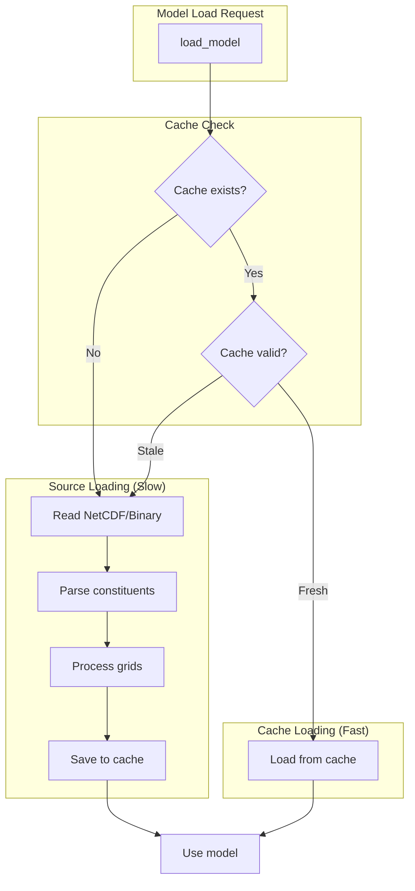
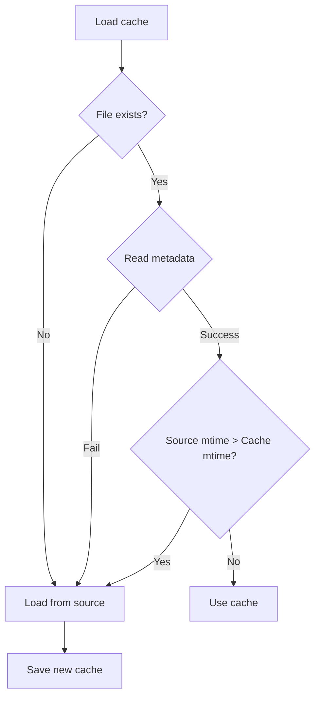
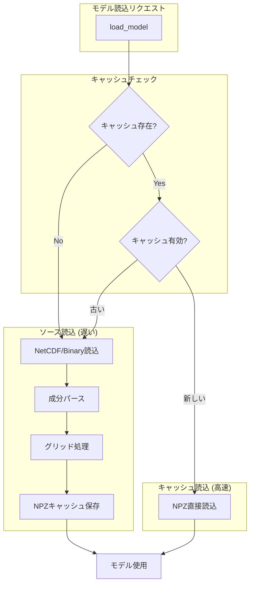
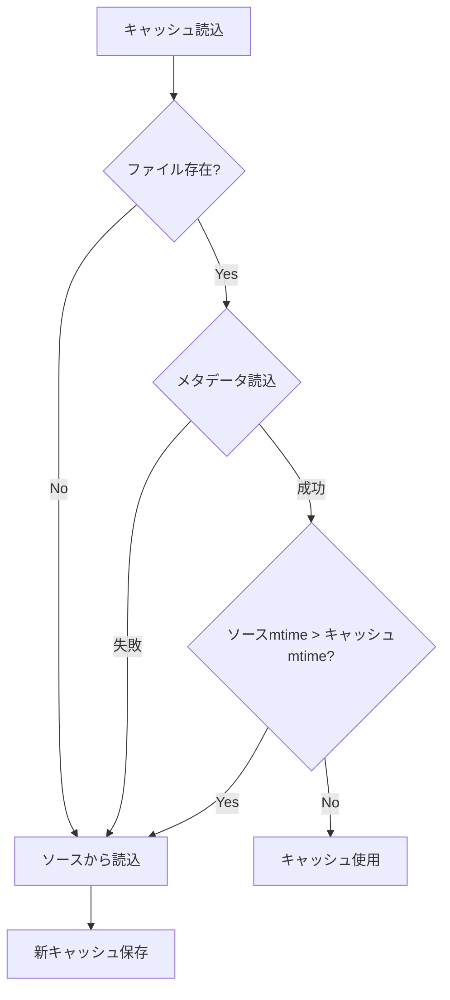

# Cache System

[English](#english) | [日本語](#japanese)

---

<a name="english"></a>
## English

### Overview

pyTMD_turbo's cache system provides **zero-config acceleration** for tidal model loading. By caching pre-processed model data to disk, repeated model loads are 10-100x faster.



### How It Works

#### Cache File Location

By default, cache files are stored alongside the model data:

```
/path/to/models/GOT5.5/
├── GOT5.5_ocean_load.nc
├── GOT5.5_ocean_pole.nc
├── ...
└── .pytmd_turbo_cache.npz    ← Cache file
```

With `PYTMD_TURBO_CACHE_DIR`, all caches go to a central location:

```
/custom/cache/dir/
├── GOT5.5.npz
├── TPXO9-atlas-v5.npz
└── FES2014.npz
```

#### Cache Invalidation

The cache is automatically invalidated when:

1. **Source files are modified** - Cache stores source file timestamps
2. **Cache file is corrupted** - Falls back to source loading
3. **Cache version mismatch** - Future-proofing for format changes



#### Cache Contents

The cache file contains:

| Key | Description | Shape |
|-----|-------------|-------|
| `hc_real_{constituent}` | Real part of harmonic constant | (n_lat, n_lon) |
| `hc_imag_{constituent}` | Imaginary part | (n_lat, n_lon) |
| `lon` | Longitude grid | (n_lon,) |
| `lat` | Latitude grid | (n_lat,) |
| `omega` | Angular frequencies | (n_constituents,) |
| `phase_0` | Initial phases | (n_constituents,) |
| `_metadata_json` | Metadata (mtime, version) | (1,) |

### API Reference

#### Global Control

```python
from pyTMD_turbo import cache

# Disable/enable globally
cache.disable_cache()      # Disable all caching
cache.enable_cache()       # Re-enable caching

# Check status
cache.is_cache_enabled()   # Returns bool
```

#### Per-Model Control

```python
from pyTMD_turbo import cache

# Disable for specific models
cache.disable_cache_for('GOT5.5', 'TPXO9')

# Re-enable
cache.enable_cache_for('GOT5.5')

# Check status
cache.is_cache_enabled_for('GOT5.5')  # Returns bool
```

#### Context Managers

```python
from pyTMD_turbo import cache
import pyTMD_turbo

# Temporarily disable all caching
with cache.cache_disabled():
    tide = pyTMD_turbo.tide_elevations(...)
    # Cache is disabled in this block

# Temporarily disable for specific model
with cache.cache_disabled_for('GOT5.5'):
    tide = pyTMD_turbo.tide_elevations(..., model='GOT5.5')
```

#### Cache Operations

```python
from pyTMD_turbo import cache

# View cache status
cache.show_cache_status()
# Output:
# Model                Size       Created              Temp  Path
# ---------------------------------------------------------------------------
# GOT5.5               45.2 MB    2024-01-15T10:30:00  No    /path/to/.pytmd...

# Get programmatic info
info = cache.get_cache_info()
# [{'model': 'GOT5.5', 'path': '...', 'size': 47380480, ...}]

# Clear specific cache
cache.clear_cache('GOT5.5')

# Clear all caches
count = cache.clear_all_cache()
print(f"Deleted {count} cache files")

# Force rebuild (delete + rebuild on next load)
cache.rebuild_cache('GOT5.5')
cache.rebuild_all_cache()
```

### Environment Variables

| Variable | Values | Description |
|----------|--------|-------------|
| `PYTMD_TURBO_DISABLED` | `1`, `true`, `yes` | Disable cache globally |
| `PYTMD_TURBO_DISABLED_MODELS` | `GOT5.5,TPXO9` | Comma-separated list of models to disable |
| `PYTMD_TURBO_CACHE_DIR` | `/path/to/cache` | Central cache directory |
| `PYTMD_TURBO_TEMP_CACHE` | `1`, `true`, `yes` | Delete cache on process exit |

#### Examples

```bash
# Disable caching for CI/testing
export PYTMD_TURBO_DISABLED=1

# Use central cache directory
export PYTMD_TURBO_CACHE_DIR=/tmp/tide_cache

# Auto-cleanup for ephemeral processing
export PYTMD_TURBO_TEMP_CACHE=1

# Disable only for specific models
export PYTMD_TURBO_DISABLED_MODELS=GOT5.5,experimental-model
```

### Temporary Cache Mode

Temporary cache mode automatically deletes cache files when the Python process exits. Useful for:

- CI/CD pipelines
- Docker containers
- One-time batch processing
- Testing

```python
from pyTMD_turbo import cache

# Enable temp mode
cache.enable_temp_cache()

# ... do work ...
# Cache files created after this point are auto-deleted on exit

# Disable temp mode (new caches will persist)
cache.disable_temp_cache()
```

Or via environment:

```bash
PYTMD_TURBO_TEMP_CACHE=1 python my_script.py
# Cache files are deleted when script exits
```

### Thread Safety

The cache system is thread-safe:

- State is protected by `threading.Lock`
- Multiple threads can read the same cache
- Cache writes are atomic (write to temp, then rename)

```python
from concurrent.futures import ThreadPoolExecutor
import pyTMD_turbo

def predict_tide(location):
    lon, lat = location
    return pyTMD_turbo.tide_elevations(lon, lat, times, model='GOT5.5')

# Safe to use from multiple threads
with ThreadPoolExecutor(max_workers=4) as executor:
    results = list(executor.map(predict_tide, locations))
```

### Troubleshooting

#### Cache Not Working

```python
from pyTMD_turbo import cache

# Check if enabled
print(f"Global enabled: {cache.is_cache_enabled()}")
print(f"GOT5.5 enabled: {cache.is_cache_enabled_for('GOT5.5')}")

# Check environment
import os
print(f"PYTMD_TURBO_DISABLED: {os.environ.get('PYTMD_TURBO_DISABLED', 'not set')}")
```

#### Permission Errors

If cache files can't be written:

```bash
# Use a writable directory
export PYTMD_TURBO_CACHE_DIR=/tmp/tide_cache

# Or disable caching
export PYTMD_TURBO_DISABLED=1
```

#### Stale Cache

If predictions seem wrong after model update:

```python
from pyTMD_turbo import cache

# Force rebuild
cache.rebuild_cache('GOT5.5')
```

### Performance Impact

| Scenario | Without Cache | With Cache | Speedup |
|----------|---------------|------------|---------|
| First load (GOT5.5) | 2.1s | 2.1s + 0.5s (save) | - |
| Subsequent loads | 2.1s | 0.02s | **100x** |
| Large model (TPXO9) | 8.5s | 0.15s | **57x** |

```mermaid
gantt
    title Model Load Time Comparison
    dateFormat X
    axisFormat %L ms

    section Without Cache
    Read NetCDF    :0, 1500
    Parse          :1500, 2100

    section With Cache
    Load cache     :0, 20
```



---

<a name="japanese"></a>
## 日本語

### 概要

pyTMD_turboのキャッシュシステムは、潮汐モデル読み込みの**ゼロ設定高速化**を提供します。前処理済みモデルデータをディスクにキャッシュすることで、繰り返しのモデル読み込みが10-100倍高速になります。



### 動作の仕組み

#### キャッシュファイルの場所

デフォルトでは、キャッシュファイルはモデルデータと同じ場所に保存されます：

```
/path/to/models/GOT5.5/
├── GOT5.5_ocean_load.nc
├── GOT5.5_ocean_pole.nc
├── ...
└── .pytmd_turbo_cache.npz    ← キャッシュファイル
```

`PYTMD_TURBO_CACHE_DIR`を使用すると、すべてのキャッシュが中央の場所に保存されます：

```
/custom/cache/dir/
├── GOT5.5.npz
├── TPXO9-atlas-v5.npz
└── FES2014.npz
```

#### キャッシュの無効化

キャッシュは以下の場合に自動的に無効化されます：

1. **ソースファイルが変更された** - キャッシュはソースファイルのタイムスタンプを保存
2. **キャッシュファイルが破損** - ソース読み込みにフォールバック
3. **キャッシュバージョンの不一致** - 将来のフォーマット変更に対応



#### キャッシュの内容

NPZキャッシュには以下が含まれます：

| キー | 説明 | 形状 |
|-----|------|------|
| `hc_real_{constituent}` | 調和定数の実部 | (n_lat, n_lon) |
| `hc_imag_{constituent}` | 虚部 | (n_lat, n_lon) |
| `lon` | 経度グリッド | (n_lon,) |
| `lat` | 緯度グリッド | (n_lat,) |
| `omega` | 角周波数 | (n_constituents,) |
| `phase_0` | 初期位相 | (n_constituents,) |
| `_metadata_json` | メタデータ（mtime、バージョン） | (1,) |

### APIリファレンス

#### グローバル制御

```python
from pyTMD_turbo import cache

# グローバルに無効化/有効化
cache.disable_cache()      # すべてのキャッシュを無効化
cache.enable_cache()       # キャッシュを再有効化

# ステータス確認
cache.is_cache_enabled()   # boolを返す
```

#### モデル別制御

```python
from pyTMD_turbo import cache

# 特定モデルを無効化
cache.disable_cache_for('GOT5.5', 'TPXO9')

# 再有効化
cache.enable_cache_for('GOT5.5')

# ステータス確認
cache.is_cache_enabled_for('GOT5.5')  # boolを返す
```

#### コンテキストマネージャ

```python
from pyTMD_turbo import cache
import pyTMD_turbo

# 一時的にすべてのキャッシュを無効化
with cache.cache_disabled():
    tide = pyTMD_turbo.tide_elevations(...)
    # このブロック内ではキャッシュ無効

# 特定モデルを一時的に無効化
with cache.cache_disabled_for('GOT5.5'):
    tide = pyTMD_turbo.tide_elevations(..., model='GOT5.5')
```

#### キャッシュ操作

```python
from pyTMD_turbo import cache

# キャッシュステータス表示
cache.show_cache_status()
# 出力:
# Model                Size       Created              Temp  Path
# ---------------------------------------------------------------------------
# GOT5.5               45.2 MB    2024-01-15T10:30:00  No    /path/to/.pytmd...

# プログラム的に情報取得
info = cache.get_cache_info()
# [{'model': 'GOT5.5', 'path': '...', 'size': 47380480, ...}]

# 特定キャッシュを削除
cache.clear_cache('GOT5.5')

# すべてのキャッシュを削除
count = cache.clear_all_cache()
print(f"{count}個のキャッシュファイルを削除")

# 強制再構築（削除 + 次回読込時に再構築）
cache.rebuild_cache('GOT5.5')
cache.rebuild_all_cache()
```

### 環境変数

| 変数 | 値 | 説明 |
|------|-----|------|
| `PYTMD_TURBO_DISABLED` | `1`, `true`, `yes` | キャッシュをグローバルに無効化 |
| `PYTMD_TURBO_DISABLED_MODELS` | `GOT5.5,TPXO9` | 無効化するモデルのカンマ区切りリスト |
| `PYTMD_TURBO_CACHE_DIR` | `/path/to/cache` | 中央キャッシュディレクトリ |
| `PYTMD_TURBO_TEMP_CACHE` | `1`, `true`, `yes` | プロセス終了時にキャッシュを削除 |

#### 使用例

```bash
# CI/テスト用にキャッシュ無効化
export PYTMD_TURBO_DISABLED=1

# 中央キャッシュディレクトリを使用
export PYTMD_TURBO_CACHE_DIR=/tmp/tide_cache

# 一時処理用に自動クリーンアップ
export PYTMD_TURBO_TEMP_CACHE=1

# 特定モデルのみ無効化
export PYTMD_TURBO_DISABLED_MODELS=GOT5.5,experimental-model
```

### 一時キャッシュモード

一時キャッシュモードは、Pythonプロセス終了時にキャッシュファイルを自動削除します。以下に便利：

- CI/CDパイプライン
- Dockerコンテナ
- 一回限りのバッチ処理
- テスト

```python
from pyTMD_turbo import cache

# 一時モードを有効化
cache.enable_temp_cache()

# ... 処理 ...
# この後に作成されたキャッシュファイルは終了時に自動削除

# 一時モードを無効化（新しいキャッシュは永続化）
cache.disable_temp_cache()
```

または環境変数で：

```bash
PYTMD_TURBO_TEMP_CACHE=1 python my_script.py
# スクリプト終了時にキャッシュファイルが削除される
```

### スレッドセーフティ

キャッシュシステムはスレッドセーフです：

- 状態は`threading.Lock`で保護
- 複数スレッドが同じキャッシュを読み取り可能
- キャッシュ書き込みはアトミック（一時ファイルに書き込み、リネーム）

```python
from concurrent.futures import ThreadPoolExecutor
import pyTMD_turbo

def predict_tide(location):
    lon, lat = location
    return pyTMD_turbo.tide_elevations(lon, lat, times, model='GOT5.5')

# 複数スレッドから安全に使用可能
with ThreadPoolExecutor(max_workers=4) as executor:
    results = list(executor.map(predict_tide, locations))
```

### トラブルシューティング

#### キャッシュが機能しない

```python
from pyTMD_turbo import cache

# 有効か確認
print(f"グローバル有効: {cache.is_cache_enabled()}")
print(f"GOT5.5有効: {cache.is_cache_enabled_for('GOT5.5')}")

# 環境変数確認
import os
print(f"PYTMD_TURBO_DISABLED: {os.environ.get('PYTMD_TURBO_DISABLED', '未設定')}")
```

#### パーミッションエラー

キャッシュファイルが書き込めない場合：

```bash
# 書き込み可能なディレクトリを使用
export PYTMD_TURBO_CACHE_DIR=/tmp/tide_cache

# またはキャッシュを無効化
export PYTMD_TURBO_DISABLED=1
```

#### 古いキャッシュ

モデル更新後に予測が正しくない場合：

```python
from pyTMD_turbo import cache

# 強制再構築
cache.rebuild_cache('GOT5.5')
```

### パフォーマンスへの影響

| シナリオ | キャッシュなし | キャッシュあり | 高速化 |
|----------|---------------|---------------|--------|
| 初回読込（GOT5.5） | 2.1s | 2.1s + 0.5s（保存） | - |
| 2回目以降 | 2.1s | 0.02s | **100倍** |
| 大規模モデル（TPXO9） | 8.5s | 0.15s | **57倍** |

```mermaid
gantt
    title モデル読込時間の比較
    dateFormat X
    axisFormat %L ms

    section キャッシュなし
    NetCDF読込    :0, 1500
    パース        :1500, 2100

    section キャッシュあり
    NPZ読込       :0, 20
```



---

## See Also / 関連ファイル

- `pyTMD_turbo/cache.py` - Cache implementation
- [Optimization Techniques](optimization.md) - Overall optimization strategy
