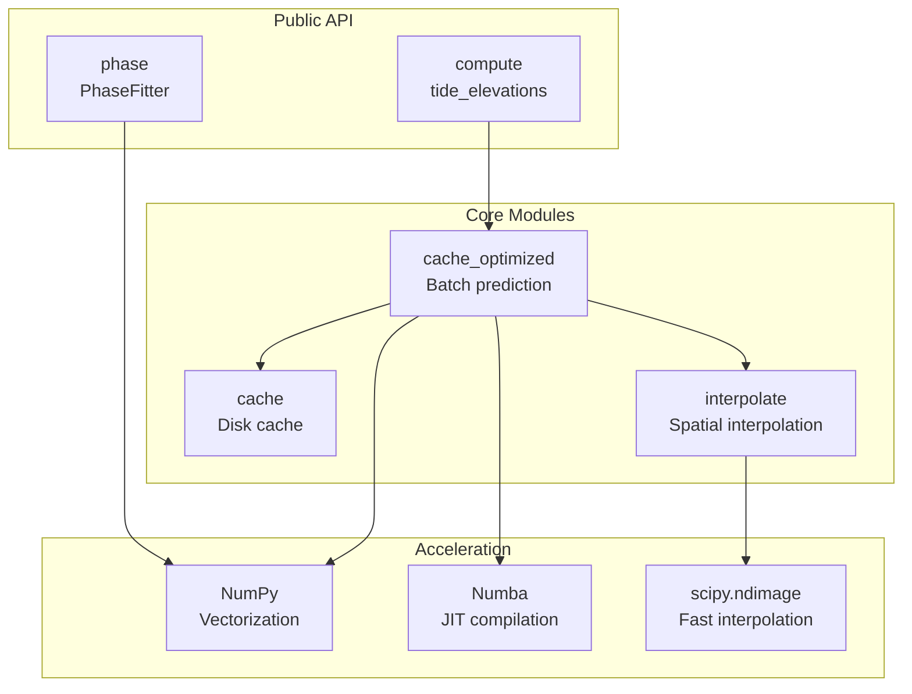
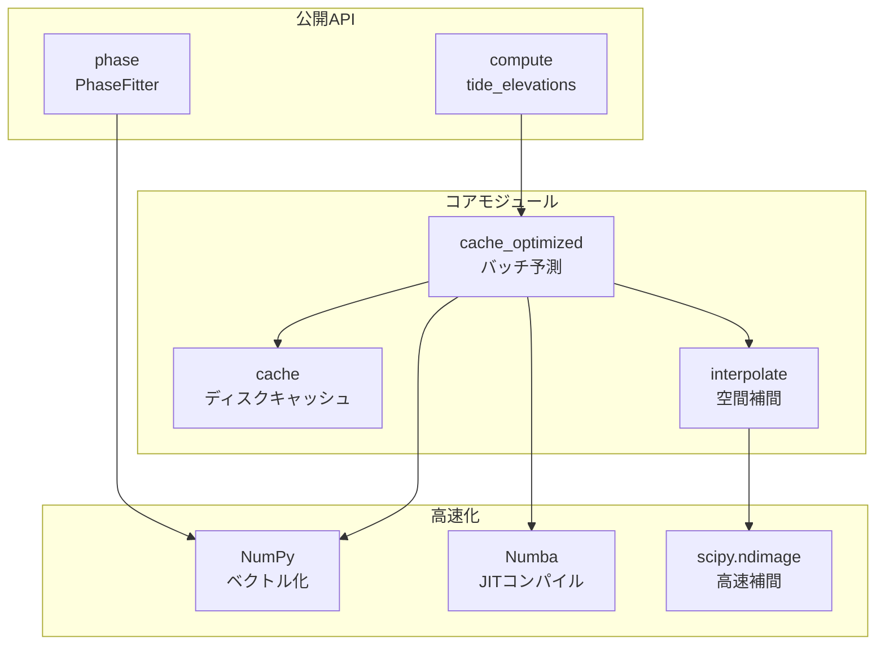

# pyTMD_turbo Documentation

[English](#english) | [日本語](#japanese)

---

<a name="english"></a>
## English

pyTMD_turbo is a high-performance wrapper module for pyTMD.

### Architecture



### Documentation

- **[Optimization Techniques](optimization.md)** - Detailed optimization techniques
- **[Cache System](cache.md)** - Zero-config caching system
- **[Aux API (Phase)](aux_api.md)** - Phase calculation API

### Modules

#### Core API

- **compute** - High-speed tidal calculation API
  - `tide_elevations()` - Tide elevation calculation
  - `tide_currents()` - Tide current calculation
  - `SET_displacements()` - Solid Earth Tide displacement
  - `LPET_elevations()` - Long-period equilibrium tide
  - `init_model()` - Model initialization

- **cache** - Cache control system
  - Environment variable control
  - Per-model enable/disable

#### Auxiliary API

- **[phase (aux)](aux_api.md)** - Phase calculation module
  - Phase fitting
  - Derivative computation
  - Constituent analysis

### Quick Start

```python
import numpy as np
from pyTMD_turbo.compute import tide_elevations, init_model
from pyTMD_turbo.phase import fit_phase

# Initialize model
init_model('GOT5.5', '~/path/to/models')

# Calculate tide elevations
lon = np.array([142.2178])
lat = np.array([27.0744])
mjd = np.array([60676.5])  # 2025-01-01 12:00

tide = tide_elevations(lon, lat, mjd, model='GOT5.5')

# Phase fitting and derivative
t = np.linspace(0, 86400 * 3, 240)
fitter = fit_phase(t, tide_data)
derivatives = fitter.derivative(t_eval)
```

### Environment Variables

| Variable | Description |
|----------|-------------|
| `PYTMD_TURBO_DISABLED` | Disable cache with `1`, `true`, or `yes` |
| `PYTMD_TURBO_DISABLED_MODELS` | Comma-separated list of models to disable |
| `PYTMD_TURBO_TEMP_CACHE` | Enable temporary cache mode |
| `PYTMD_TURBO_CACHE_DIR` | Custom cache directory |

### Performance

#### Aux API (Phase Module)

| Operation | Time |
|-----------|------|
| Derivative (3 points) | 0.88 µs |
| Derivative (1000 points) | 62.3 µs |
| Fitting (240 points) | 65.1 µs |

#### Optimization Strategy

- Small batch: Numba JIT (single-threaded)
- Large batch: NumPy vectorized
- Fitting: LAPACK (lstsq)

All methods are single-threaded optimized to avoid parallel overhead.

### Examples

- `examples/run_benchmark.py` - pyTMD vs pyTMD_turbo benchmark (HTML report)
- `examples/set_comparison.py` - SET comparison visualization
- `examples/phase_visualization.py` - Phase visualization
- `examples/phase_benchmark.py` - Performance benchmark
- `examples/numba_benchmark.py` - Numba comparison

---

<a name="japanese"></a>
## 日本語

pyTMD_turbo は、pyTMD の高速化ラッパーモジュールです。

### アーキテクチャ



### ドキュメント

- **[高速化技法](optimization.md)** - 最適化技法の詳細
- **[キャッシュシステム](cache.md)** - ゼロ設定キャッシュシステム
- **[Aux API（位相計算）](aux_api.md)** - 位相計算API

### モジュール

#### Core API

- **compute** - 潮汐計算の高速化API
  - `tide_elevations()` - 潮位計算
  - `tide_currents()` - 潮流計算
  - `SET_displacements()` - 固体地球潮汐変位
  - `LPET_elevations()` - 長周期平衡潮汐
  - `init_model()` - モデル初期化

- **cache** - キャッシュ制御システム
  - 環境変数による制御
  - モデル別の有効化/無効化

#### Auxiliary API

- **[phase (aux)](aux_api.md)** - 位相計算モジュール
  - 位相フィッティング
  - 微分計算
  - 成分分析

### クイックスタート

```python
import numpy as np
from pyTMD_turbo.compute import tide_elevations, init_model
from pyTMD_turbo.phase import fit_phase

# モデル初期化
init_model('GOT5.5', '~/path/to/models')

# 潮位計算
lon = np.array([142.2178])
lat = np.array([27.0744])
mjd = np.array([60676.5])  # 2025-01-01 12:00

tide = tide_elevations(lon, lat, mjd, model='GOT5.5')

# 位相フィッティングと微分
t = np.linspace(0, 86400 * 3, 240)
fitter = fit_phase(t, tide_data)
derivatives = fitter.derivative(t_eval)
```

### 環境変数

| 変数 | 説明 |
|------|------|
| `PYTMD_TURBO_DISABLED` | `1`, `true`, `yes` でキャッシュ無効化 |
| `PYTMD_TURBO_DISABLED_MODELS` | カンマ区切りでモデル指定 |
| `PYTMD_TURBO_TEMP_CACHE` | 一時キャッシュモード有効化 |
| `PYTMD_TURBO_CACHE_DIR` | カスタムキャッシュディレクトリ |

### パフォーマンス

#### Aux API（位相モジュール）

| 処理 | 時間 |
|------|------|
| 微分計算（3点） | 0.88 µs |
| 微分計算（1000点） | 62.3 µs |
| フィッティング（240点） | 65.1 µs |

#### 最適化戦略

- 小バッチ: Numba JIT（シングルスレッド）
- 大バッチ: NumPy vectorized
- フィッティング: LAPACK（lstsq）

並列処理オーバーヘッドを回避するため、すべてシングルスレッド最適化。

### サンプル

- `examples/run_benchmark.py` - pyTMD vs pyTMD_turbo ベンチマーク（HTMLレポート）
- `examples/set_comparison.py` - SET比較可視化
- `examples/phase_visualization.py` - 位相可視化
- `examples/phase_benchmark.py` - パフォーマンス計測
- `examples/numba_benchmark.py` - Numba比較
