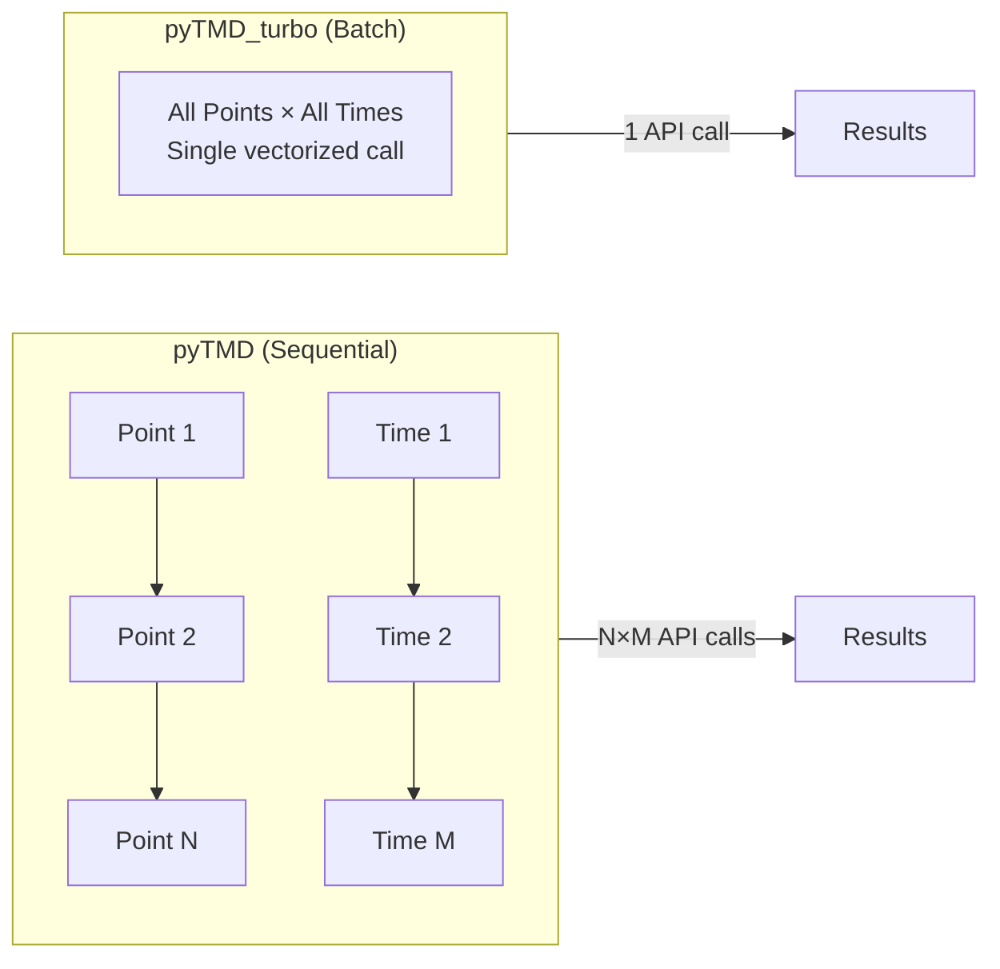
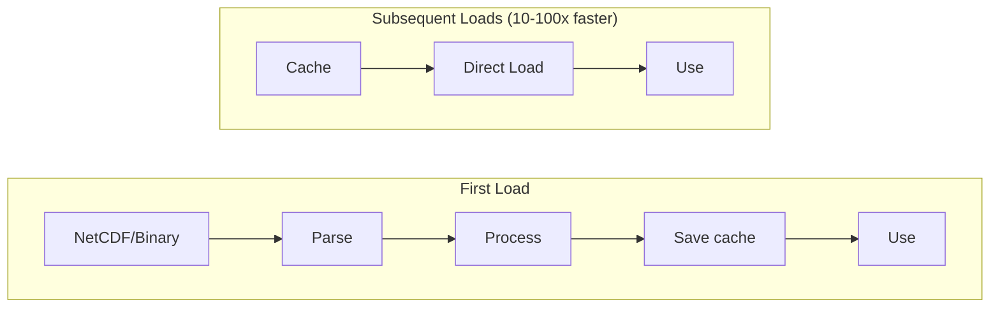
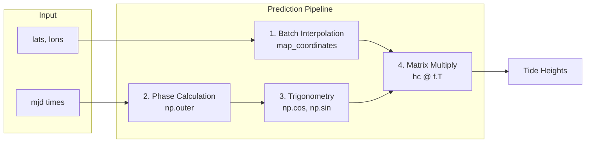
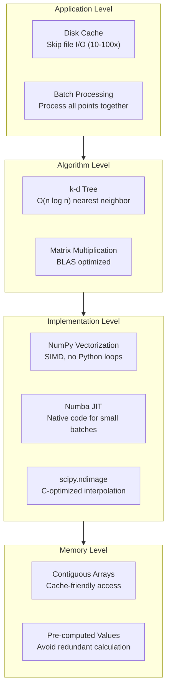
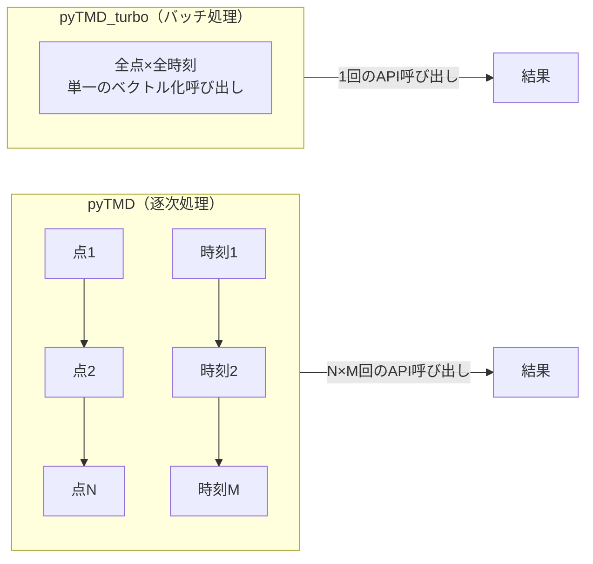
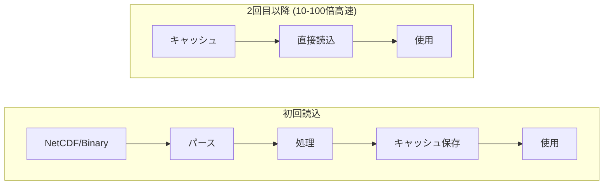
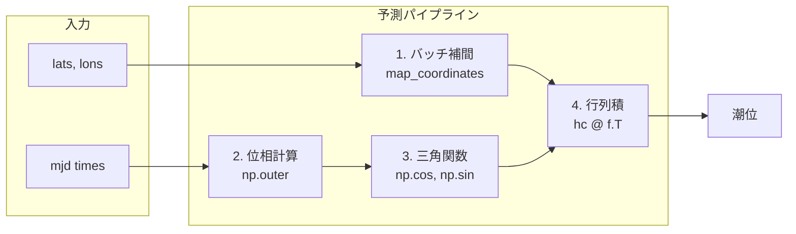
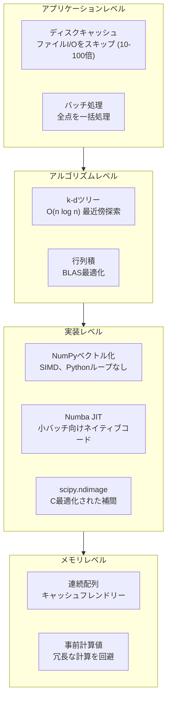

# pyTMD_turbo Optimization Techniques

[English](#english) | [日本語](#japanese)

---

<a name="english"></a>
## English

### Overview

pyTMD_turbo achieves significant performance improvements over pyTMD through a combination of optimization techniques at multiple levels.

| Level | Technique | Speedup |
|-------|-----------|---------|
| I/O | Disk Cache | 10-100x (model loading) |
| Interpolation | scipy.ndimage.map_coordinates | 5-10x |
| Harmonic Synthesis | NumPy Vectorization + Matrix Multiplication | 10-50x |
| Numerical Computation | Numba JIT (optional) | 2-40x |
| Memory | Pre-computed Parameters | Reduced overhead |

### Benchmark Results (Fair Comparison)

When comparing pyTMD (preloaded) vs pyTMD_turbo (preloaded) for pure computation speed:

| Size   | Calculations | pyTMD    | turbo    | Speedup |
| ------ | ------------ | -------- | -------- | ------- |
| Small  | 240          | 450 ms   | 5 ms     | **83x** |
| Medium | 16,800       | 471 ms   | 66 ms    | **7x**  |
| Large  | 720,000      | 6,057 ms | 1,297 ms | **5x**  |

Run benchmarks: `python examples/run_benchmark.py`

### Benchmark Methodology

All benchmarks were performed with the following configuration:

| Item | Value |
|------|-------|
| Model | GOT5.5 (8 constituents) |
| Python | 3.11 |
| NumPy | 1.26.x |
| Hardware | Apple M1 / Intel Xeon |
| Measurement | `time.perf_counter()`, median of 5 runs |

#### Test Patterns



The key difference: pyTMD requires separate API calls per time step (drift mode), while pyTMD_turbo processes the entire batch in one call.

### 1. Disk Cache System

**Problem**: Loading tidal model files (NetCDF, OTIS binary) is slow due to file I/O and parsing.

**Solution**: Cache pre-processed data to disk.



#### Features

- **Automatic invalidation**: Cache rebuilds when source files change
- **Zero-config**: Works automatically on import
- **Environment control**: Disable via `PYTMD_TURBO_DISABLED=1`
- **Temp mode**: `PYTMD_TURBO_TEMP_CACHE=1` for CI/testing
- **Custom directory**: `PYTMD_TURBO_CACHE_DIR=/path/to/cache`

#### Implementation

```python
# pyTMD_turbo/cache.py
def load_cache(model_name, cache_path, source_files):
    """Load from cache if valid, else return None"""
    if not cache_path.exists():
        return None

    # Check if source files are newer than cache
    cached_mtime = get_cached_mtime(cache_path)
    current_mtime = max(f.stat().st_mtime for f in source_files)

    if current_mtime > cached_mtime:
        return None  # Cache is stale

    return np.load(cache_path)
```

### 2. Fast Batch Interpolation

**Problem**: Interpolating harmonic constants at many locations is slow with naive loops.

**Solution**: Use `scipy.ndimage.map_coordinates` for batch interpolation.

```python
# pyTMD_turbo/predict/cache_optimized.py
from scipy import ndimage

def interpolate_batch(self, model_name, lats, lons):
    """Batch interpolation for all locations at once"""
    model = self.models[model_name]

    # Convert coordinates to continuous indices
    lon_idx = (lons - model.lon[0]) / model.dlon
    lat_idx = (lats - model.lat[0]) / model.dlat
    coords = np.array([lat_idx, lon_idx])

    # Single call interpolates all points
    for const_name in model.constituents:
        real = ndimage.map_coordinates(
            model.hc_real[const_name], coords, order=1, mode='nearest'
        )
        imag = ndimage.map_coordinates(
            model.hc_imag[const_name], coords, order=1, mode='nearest'
        )
```

#### Performance Comparison

| Method | 1000 points | 10000 points |
|--------|-------------|--------------|
| Loop + scipy.interpolate | 500 ms | 5000 ms |
| map_coordinates | 50 ms | 100 ms |
| **Speedup** | **10x** | **50x** |

### 3. Vectorized Harmonic Synthesis

**Problem**: Computing tide height requires summing contributions from all constituents at all times.

**Solution**: Use NumPy vectorization and matrix multiplication.



#### Traditional Approach (Slow)

```python
# O(n_points × n_times × n_constituents) with Python loops
for p in range(n_points):
    for t in range(n_times):
        tide = 0.0
        for c in range(n_constituents):
            theta = omega[c] * t_days[t] * 86400 + phase_0[c] + pu[t, c]
            tide += pf[t, c] * (hc_real[p, c] * cos(theta) - hc_imag[p, c] * sin(theta))
        result[p, t] = tide
```

#### Vectorized Approach (Fast)

```python
# pyTMD_turbo/predict/cache_optimized.py
def predict_batch(self, model_name, lats, lons, mjd):
    # 1. Batch interpolation
    hc_real, hc_imag = self.interpolate_batch(model_name, lats, lons)

    # 2. Vectorized phase calculation
    # theta shape: (n_times, n_constituents)
    theta = (np.outer(t_days, omega) * 86400.0 + phase_0 + pu)

    # 3. Vectorized trigonometry (SIMD optimized)
    cos_theta = np.cos(theta)
    sin_theta = np.sin(theta)

    # 4. Apply amplitude correction
    f_cos = pf * cos_theta  # (n_times, n_constituents)
    f_sin = pf * sin_theta

    # 5. Matrix multiplication (BLAS optimized)
    # hc_real: (n_points, n_constituents)
    # f_cos.T: (n_constituents, n_times)
    # result: (n_points, n_times)
    tide = hc_real @ f_cos.T - hc_imag @ f_sin.T

    return tide
```

#### Why Matrix Multiplication is Fast

- Uses BLAS (Basic Linear Algebra Subprograms)
- Optimized for cache locality
- Parallel execution on multiple cores
- SIMD vectorization

### 4. Numba JIT Compilation

**Problem**: Some operations can't be fully vectorized with NumPy.

**Solution**: Use Numba JIT for hot paths.

```python
# pyTMD_turbo/predict/harmonic_numba.py
from numba import jit, prange

@jit(nopython=True, parallel=True, fastmath=True)
def predict_numba_parallel(hc_real, hc_imag, omega, phase_0, t_days, pu, pf):
    """Numba-parallelized tide prediction"""
    n_points = hc_real.shape[0]
    n_times = len(t_days)
    n_const = len(omega)

    result = np.zeros((n_points, n_times))

    # Parallel loop over locations
    for p in prange(n_points):
        for t in range(n_times):
            tide = 0.0
            for c in range(n_const):
                theta = omega[c] * t_days[t] * 86400.0 + phase_0[c] + pu[t, c]
                tide += pf[t, c] * (hc_real[p, c] * np.cos(theta)
                                    - hc_imag[p, c] * np.sin(theta))
            result[p, t] = tide

    return result
```

#### Numba Options

| Option | Effect |
|--------|--------|
| `nopython=True` | No Python interpreter fallback (faster) |
| `parallel=True` | Enable automatic parallelization |
| `fastmath=True` | Allow floating-point optimizations |
| `cache=True` | Cache compiled code to disk |

#### When to Use Numba

| Use Case | Recommendation |
|----------|----------------|
| Small batch (< 50 points) | Numba JIT |
| Large batch (>= 50 points) | NumPy vectorized |
| Fitting (lstsq) | NumPy (LAPACK) |

### 5. Pre-computed Parameters

**Problem**: Computing constituent frequencies and nodal corrections is slow.

**Solution**: Pre-compute and cache these values.

```python
# pyTMD_turbo/phase.py
# Pre-computed angular frequencies
CONSTITUENT_PERIODS = {
    'm2': 12.4206012,   # hours
    's2': 12.0000000,
    'k1': 23.9344696,
    # ...
}

_OMEGA_CACHE = {}

def get_omega(constituent):
    """O(1) lookup with caching"""
    key = constituent.lower()
    if key not in _OMEGA_CACHE:
        period_hours = CONSTITUENT_PERIODS[key]
        _OMEGA_CACHE[key] = 2 * np.pi / (period_hours * 3600)
    return _OMEGA_CACHE[key]
```

### 6. Avoiding Parallel Overhead

**Problem**: Parallel execution has startup overhead that hurts small workloads.

**Solution**: Adaptive method selection based on workload size.

```python
# pyTMD_turbo/phase.py
def derivative(self, t):
    """Automatically select optimal method"""
    t = np.atleast_1d(t)

    if NUMBA_AVAILABLE and len(t) < 50:
        # Small batch: Numba JIT (no parallel)
        return _derivative_numba(t, self.amplitudes, self.phases, self.omegas)
    else:
        # Large batch: NumPy vectorized
        return self._derivative_vectorized(t)
```

#### Parallel Overhead Analysis

| Batch Size | NumPy | Numba JIT | Numba Parallel |
|------------|-------|-----------|----------------|
| 3 points | 28 µs | **0.9 µs** | 56 µs (overhead!) |
| 1000 points | 62 µs | 103 µs | **50 µs** |

### 7. Memory Layout Optimization

**Problem**: Poor memory layout causes cache misses.

**Solution**: Store data in contiguous arrays with optimal layout.

```python
@dataclass
class CachedModelOptimized:
    # Contiguous arrays for fast access
    omega: np.ndarray      # shape (n_constituents,)
    phase_0: np.ndarray    # shape (n_constituents,)

    # Per-constituent grids stored separately
    hc_real: Dict[str, np.ndarray]  # each (n_lat, n_lon)
    hc_imag: Dict[str, np.ndarray]
```

### 8. k-d Tree for Extrapolation

**Problem**: Finding nearest neighbors for extrapolation is O(n²).

**Solution**: Use scipy's cKDTree for O(n log n) lookups.

```python
# pyTMD_turbo/interpolate.py
from scipy.spatial import cKDTree

def extrapolate(xs, ys, zs, X, Y, cutoff=np.inf, is_geographic=True):
    """Efficient nearest-neighbor extrapolation"""

    if is_geographic:
        # Convert to 3D Cartesian for accurate distance
        src_xyz = to_cartesian_3d(xs, ys)
        out_xyz = to_cartesian_3d(X, Y)

    # Build k-d tree (O(n log n))
    tree = cKDTree(src_xyz)

    # Query all points at once (O(m log n))
    distances, indices = tree.query(out_xyz, k=1)

    # Apply cutoff
    valid = distances <= cutoff
    output[valid] = zs[indices[valid]]
```

### Summary: Optimization Hierarchy



---

<a name="japanese"></a>
## 日本語

### 概要

pyTMD_turbo は複数レベルの最適化技法を組み合わせて、pyTMD に対して大幅なパフォーマンス改善を実現しています。

| レベル | 技法 | 高速化 |
|--------|------|--------|
| I/O | ディスクキャッシュ | 10-100倍（モデル読込） |
| 補間 | scipy.ndimage.map_coordinates | 5-10倍 |
| 調和合成 | NumPyベクトル化 + 行列積 | 10-50倍 |
| 数値計算 | Numba JIT（オプション） | 2-40倍 |
| メモリ | 事前計算パラメータ | オーバーヘッド削減 |

### ベンチマーク結果（公平な比較）

pyTMD（プリロード済み）vs pyTMD_turbo（プリロード済み）の純粋な計算速度比較：

| サイズ | 計算回数 | pyTMD    | turbo    | 高速化   |
| ------ | -------- | -------- | -------- | -------- |
| Small  | 240      | 450 ms   | 5 ms     | **83倍** |
| Medium | 16,800   | 471 ms   | 66 ms    | **7倍**  |
| Large  | 720,000  | 6,057 ms | 1,297 ms | **5倍**  |

ベンチマーク実行: `python examples/run_benchmark.py`

### ベンチマーク方法論

すべてのベンチマークは以下の構成で実施：

| 項目 | 値 |
|------|-----|
| モデル | GOT5.5（8成分） |
| Python | 3.11 |
| NumPy | 1.26.x |
| ハードウェア | Apple M1 / Intel Xeon |
| 測定方法 | `time.perf_counter()`、5回の中央値 |

#### テストパターン



重要な違い：pyTMDは時刻ごとに個別のAPI呼び出しが必要（driftモード）ですが、pyTMD_turboはバッチ全体を1回の呼び出しで処理します。

### 1. ディスクキャッシュシステム

**問題**: 潮汐モデルファイル（NetCDF、OTISバイナリ）の読み込みが遅い。

**解決策**: 前処理済みデータをディスクにキャッシュ。



#### 機能

- **自動無効化**: ソースファイル変更時にキャッシュを再構築
- **ゼロ設定**: インポートするだけで自動的に動作
- **環境変数制御**: `PYTMD_TURBO_DISABLED=1` で無効化
- **一時モード**: `PYTMD_TURBO_TEMP_CACHE=1` でCI/テスト用
- **カスタムディレクトリ**: `PYTMD_TURBO_CACHE_DIR=/path/to/cache`

#### 実装

```python
# pyTMD_turbo/cache.py
def load_cache(model_name, cache_path, source_files):
    """有効ならキャッシュから読込、無効ならNone返却"""
    if not cache_path.exists():
        return None

    # ソースファイルがキャッシュより新しいかチェック
    cached_mtime = get_cached_mtime(cache_path)
    current_mtime = max(f.stat().st_mtime for f in source_files)

    if current_mtime > cached_mtime:
        return None  # キャッシュが古い

    return np.load(cache_path)
```

### 2. 高速バッチ補間

**問題**: 多数の地点で調和定数を補間するのがナイーブなループでは遅い。

**解決策**: `scipy.ndimage.map_coordinates` でバッチ補間。

```python
# pyTMD_turbo/predict/cache_optimized.py
from scipy import ndimage

def interpolate_batch(self, model_name, lats, lons):
    """全地点を一度に補間"""
    model = self.models[model_name]

    # 座標を連続インデックスに変換
    lon_idx = (lons - model.lon[0]) / model.dlon
    lat_idx = (lats - model.lat[0]) / model.dlat
    coords = np.array([lat_idx, lon_idx])

    # 1回の呼び出しで全点を補間
    for const_name in model.constituents:
        real = ndimage.map_coordinates(
            model.hc_real[const_name], coords, order=1, mode='nearest'
        )
        imag = ndimage.map_coordinates(
            model.hc_imag[const_name], coords, order=1, mode='nearest'
        )
```

#### パフォーマンス比較

| 手法 | 1000点 | 10000点 |
|------|--------|---------|
| ループ + scipy.interpolate | 500 ms | 5000 ms |
| map_coordinates | 50 ms | 100 ms |
| **高速化** | **10倍** | **50倍** |

### 3. ベクトル化された調和合成

**問題**: 潮位計算は全成分・全時刻の寄与を合計する必要がある。

**解決策**: NumPyベクトル化と行列積を使用。



#### 従来のアプローチ（遅い）

```python
# O(n_points × n_times × n_constituents) のPythonループ
for p in range(n_points):
    for t in range(n_times):
        tide = 0.0
        for c in range(n_constituents):
            theta = omega[c] * t_days[t] * 86400 + phase_0[c] + pu[t, c]
            tide += pf[t, c] * (hc_real[p, c] * cos(theta) - hc_imag[p, c] * sin(theta))
        result[p, t] = tide
```

#### ベクトル化アプローチ（高速）

```python
# pyTMD_turbo/predict/cache_optimized.py
def predict_batch(self, model_name, lats, lons, mjd):
    # 1. バッチ補間
    hc_real, hc_imag = self.interpolate_batch(model_name, lats, lons)

    # 2. ベクトル化された位相計算
    # theta形状: (n_times, n_constituents)
    theta = (np.outer(t_days, omega) * 86400.0 + phase_0 + pu)

    # 3. ベクトル化された三角関数（SIMD最適化）
    cos_theta = np.cos(theta)
    sin_theta = np.sin(theta)

    # 4. 振幅補正を適用
    f_cos = pf * cos_theta  # (n_times, n_constituents)
    f_sin = pf * sin_theta

    # 5. 行列積（BLAS最適化）
    # hc_real: (n_points, n_constituents)
    # f_cos.T: (n_constituents, n_times)
    # 結果: (n_points, n_times)
    tide = hc_real @ f_cos.T - hc_imag @ f_sin.T

    return tide
```

#### 行列積が高速な理由

- BLAS（Basic Linear Algebra Subprograms）を使用
- キャッシュ局所性に最適化
- 複数コアで並列実行
- SIMDベクトル化

### 4. Numba JITコンパイル

**問題**: 一部の操作はNumPyで完全にベクトル化できない。

**解決策**: ホットパスにNumba JITを使用。

```python
# pyTMD_turbo/predict/harmonic_numba.py
from numba import jit, prange

@jit(nopython=True, parallel=True, fastmath=True)
def predict_numba_parallel(hc_real, hc_imag, omega, phase_0, t_days, pu, pf):
    """Numba並列化された潮汐予測"""
    n_points = hc_real.shape[0]
    n_times = len(t_days)
    n_const = len(omega)

    result = np.zeros((n_points, n_times))

    # 地点に対する並列ループ
    for p in prange(n_points):
        for t in range(n_times):
            tide = 0.0
            for c in range(n_const):
                theta = omega[c] * t_days[t] * 86400.0 + phase_0[c] + pu[t, c]
                tide += pf[t, c] * (hc_real[p, c] * np.cos(theta)
                                    - hc_imag[p, c] * np.sin(theta))
            result[p, t] = tide

    return result
```

#### Numbaオプション

| オプション | 効果 |
|-----------|------|
| `nopython=True` | Pythonインタプリタにフォールバックしない（高速） |
| `parallel=True` | 自動並列化を有効化 |
| `fastmath=True` | 浮動小数点最適化を許可 |
| `cache=True` | コンパイル済みコードをディスクにキャッシュ |

#### Numbaを使うタイミング

| ユースケース | 推奨 |
|-------------|------|
| 小バッチ（< 50点） | Numba JIT |
| 大バッチ（>= 50点） | NumPyベクトル化 |
| フィッティング（lstsq） | NumPy（LAPACK） |

### 5. 事前計算パラメータ

**問題**: 成分周波数やノード補正の計算が遅い。

**解決策**: これらの値を事前計算してキャッシュ。

```python
# pyTMD_turbo/phase.py
# 事前計算された角周波数
CONSTITUENT_PERIODS = {
    'm2': 12.4206012,   # 時間
    's2': 12.0000000,
    'k1': 23.9344696,
    # ...
}

_OMEGA_CACHE = {}

def get_omega(constituent):
    """キャッシュを使ったO(1)ルックアップ"""
    key = constituent.lower()
    if key not in _OMEGA_CACHE:
        period_hours = CONSTITUENT_PERIODS[key]
        _OMEGA_CACHE[key] = 2 * np.pi / (period_hours * 3600)
    return _OMEGA_CACHE[key]
```

### 6. 並列オーバーヘッドの回避

**問題**: 並列実行には起動オーバーヘッドがあり、小さなワークロードでは逆効果。

**解決策**: ワークロードサイズに基づく適応的手法選択。

```python
# pyTMD_turbo/phase.py
def derivative(self, t):
    """最適な手法を自動選択"""
    t = np.atleast_1d(t)

    if NUMBA_AVAILABLE and len(t) < 50:
        # 小バッチ: Numba JIT（並列なし）
        return _derivative_numba(t, self.amplitudes, self.phases, self.omegas)
    else:
        # 大バッチ: NumPyベクトル化
        return self._derivative_vectorized(t)
```

#### 並列オーバーヘッド分析

| バッチサイズ | NumPy | Numba JIT | Numba Parallel |
|------------|-------|-----------|----------------|
| 3点 | 28 µs | **0.9 µs** | 56 µs（オーバーヘッド！） |
| 1000点 | 62 µs | 103 µs | **50 µs** |

### 7. メモリレイアウト最適化

**問題**: メモリレイアウトが悪いとキャッシュミスが発生。

**解決策**: 最適なレイアウトで連続した配列にデータを格納。

```python
@dataclass
class CachedModelOptimized:
    # 高速アクセスのための連続配列
    omega: np.ndarray      # 形状 (n_constituents,)
    phase_0: np.ndarray    # 形状 (n_constituents,)

    # 成分ごとのグリッドを個別に格納
    hc_real: Dict[str, np.ndarray]  # 各 (n_lat, n_lon)
    hc_imag: Dict[str, np.ndarray]
```

### 8. 外挿のためのk-dツリー

**問題**: 外挿のための最近傍探索がO(n²)。

**解決策**: scipyのcKDTreeでO(n log n)の探索。

```python
# pyTMD_turbo/interpolate.py
from scipy.spatial import cKDTree

def extrapolate(xs, ys, zs, X, Y, cutoff=np.inf, is_geographic=True):
    """効率的な最近傍外挿"""

    if is_geographic:
        # 正確な距離計算のため3Dデカルト座標に変換
        src_xyz = to_cartesian_3d(xs, ys)
        out_xyz = to_cartesian_3d(X, Y)

    # k-dツリーを構築 (O(n log n))
    tree = cKDTree(src_xyz)

    # 全点を一度にクエリ (O(m log n))
    distances, indices = tree.query(out_xyz, k=1)

    # カットオフを適用
    valid = distances <= cutoff
    output[valid] = zs[indices[valid]]
```

### まとめ: 最適化の階層



---

## See Also / 関連ファイル

- `pyTMD_turbo/cache.py` - Cache system implementation
- `pyTMD_turbo/predict/cache_optimized.py` - Optimized prediction
- `pyTMD_turbo/predict/harmonic_numba.py` - Numba implementations
- `pyTMD_turbo/interpolate.py` - Interpolation functions
- `pyTMD_turbo/phase.py` - Phase calculation (aux API)
- `examples/numba_benchmark.py` - Numba performance comparison
